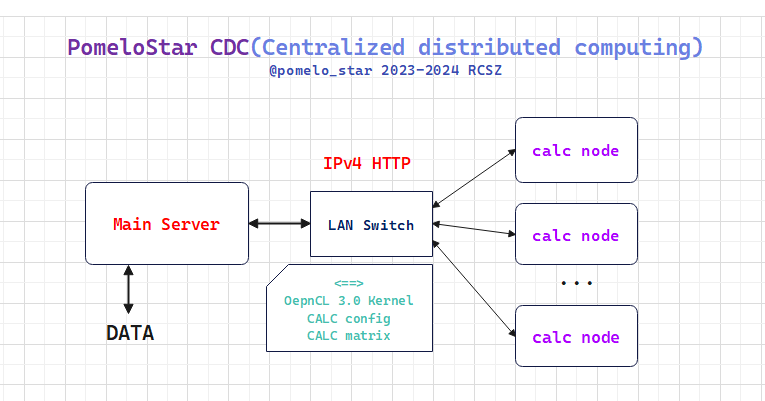

# Main Node

### 大概结构(中心化分布式):



### 各个部分引用:

cdc_mainnode_net => cdc_mainnode_panel => main

cdc_data_file => cdc_mainnode_net

cdc_main_threadpool => cdc_mainnode_net

### 头文件概述
- cdc_mainnode_panel.h
```cpp
void opengl_panel_init(
  	const char* window_title,         // 窗口标题名称
	uint32_t window_szx,              // 窗口宽[x]
	uint32_t window_szy,              // 窗口高[y]
	std::function<void()> render = {} // 渲染循环事件
);

void draw_imgui_panel(); // GUI渲染事件[imgui] draw_imgui_panel -> opengl_panel_init 
```
- cdc_mainnode_net.h
```cpp
// 主机储存的计算节点信息.
// 全局变量.
std::vector<CDC_CALC_NODE> CalcNodes::calcnodes_state;

struct CDC_CALC_NODE {

	char    node_server_address[ADDRESS_CHAR_LENv4]; // 节点IPv4地址
	int32_t node_server_port;                        // 节点端口
	bool    node_server_connect;                     // 节点连接状态 True:已连接

	std::string node_name;        // 计算节点名称
	std::string node_device_info; // 计算节点设备配置信息[OpenCL]
	uint32_t    node_state;       // 计算节点返回状态(A)

	// 主机操作:

	bool oper_connect; // 尝试连接计算节点
	bool oper_state;   // 查询计算节点状态
	bool oper_task;    // 任务分配(计算)
	bool oper_close;   // 关闭计算节点(程序)

	CDC_CALC_NODE() :
		node_server_address{ '1','2','7','.','0','.','0','.','1' },
		node_server_port(1000), node_server_connect(false),
		node_name("null"),      node_device_info("null"), node_state(0xEEEE),
		oper_connect(false)
	{}

// 计算节点返回状态(A)
#define NODE_STATE_IDLE 0xA000 // 节点空闲中
#define NODE_STATE_DTOK 0xA001 // 节点接收数据完毕(等待计算)
#define NODE_STATE_CALC 0xA002 // 节点计算中
#define NODE_STATE_WAIT 0xA003 // 节点等待中(未提取结果)

// 面板全局操作(对所有已添加节点有效)
// 全局变量
// 对应ImGui按键 0:实时监控(状态), 1:刷新所有节点状态, 2:部署任务, 3:开始计算, 4:提取计算结果
bool CalcNodes::calcnode_global_operations[5];

// 任务数据队列(只存储索引文件名)
// 全局变量
std::queue<std::string> CALC_DATA_INDEX::TaskDataFile;
};

// 计算节点指令 主机 => 计算节点
// '$' 数据指令. '*' 关闭指令.
#define NODE_REQCMD_NAME  "NodeName"  //   获取节点名称
#define NODE_REQCMD_STATE "NodeState" //   获取节点状态
#define NODE_REQCMD_INFO  "NodeDevi"  //   获取节点设备

#define NODE_REQCMD_CALC  "NodeCalc"  //   节点开始计算
#define NODE_REQCMD_RETD  "NodeRet"   // $ 节点返回数据

#define NODE_REQCMD_INPGM "NodePgm"   // $ 节点接收程序 (CL核文件)
#define NODE_REQCMD_INCFG "NodeCfg"   // $ 节点就收配置 (计算配置)
#define NODE_REQCMD_INDAT "NodeRec"   // $ 节点接收数据 (string数据流)

#define NODE_REQCMD_CLOSE "NodeClose" // * 关闭节点服务器
```
- cdc_data_file.h
- cdc_main_threadpool.hpp
- thread_safe_print.hpp
```cpp
// 三维矩阵数据 2D * N
struct DataMatrix3D {

	float*** data;

	size_t mat_xlength;
	size_t mat_ylength;
	size_t mat_zlength;
};

// 转换流程
// 矩阵源数据文件 => 三维矩阵 => vector<float> => string => 发送
// 矩阵源数据文件结构 .fpdat[txt]
// 头标签"$INFO" 矩阵数量2D 2 矩阵x长度 3 矩阵y长度 3
// 中间矩阵float32数据, 以"matrix_end"结尾
$INFO 2 3 3
0.00 0.00 0.00
0.00 0.00 0.00
0.00 0.00 0.00
matrix_end
0.00 0.00 0.00
0.00 0.00 0.00
0.00 0.00 0.00
matrix_end

// 线程池是从服务器项目上扣下来的
template<typename InClass, typename... Args_param>
xxx.Tp_PushTask<class>(param);

// 线程安全打印,为了避免线程池中输出信息冲突.
mutex print_mutex = {};
void safe_logprint(string logstr) {
    {
        lock_guard<mutex> lock(print_mutex);
        cout << logstr << endl;
    }
}
```

### 主要net部分概述
net处理部分在gui事件之后.
```cpp
// net处理最开始函数
// 输入以上说到的全局变量
void CalcNodes::calcnode_process_event(std::vector<CDC_CALC_NODE>& data);

// 1. 处理全局实时监控状态, 主机会每5000ms向每个节点发送询问一次状态
// function => 发送线程池
void calcnode_state_monitor(vector<CDC_CALC_NODE>& data)

// 2. 执行分布式部署
// 全局发送线程池
 ThreadPool::xcore_threadpool SystemThreadPool(32);
// 从系统文件发送计算配置(OCL config) function => 发送线程池 
// 从系统文件发送计算程序(CL kernel)  function => 发送线程池
// 从矩阵源数据文件发送计算数据(Matrix) function => 文件加载线程池 => 线程池
void calcnode_arrange_res(vector<CDC_CALC_NODE>& data, ThreadPool::xcore_threadpool& threadpool);
// 内部静态文件加载线程池
static ThreadPool::xcore_threadpool LoadFileThreadPool(16);

// 3. 执行分布式计算
// function => 发送线程池
void calcnode_arrange_calc(vector<CDC_CALC_NODE>& data, ThreadPool::xcore_threadpool& threadpool)

// 4. 执行计算结果提取
// function => 发送线程池
// 数据: 计算节点(S) => 结果队列 => string => vector<float> => Matrix3D => 保存到矩阵源数据文件
void calcnode_arrange_ret(vector<CDC_CALC_NODE>& data, ThreadPool::xcore_threadpool& threadpool);

// 其他为非数据操作, 开销较小
// [连接计算节点], [查询节点状态], [关闭计算节点]

// net处理最后监听结果队列 & 处理返回数据
void ProcessQueue(vector<CDC_CALC_NODE>& nodedat);
// 返回目前为主线程操作, 在写大文件时不能碰...
// 需要接收数据的指令
#define NODE_REQCMD_NAME  "NodeName"  //   节点名称
#define NODE_REQCMD_STATE "NodeState" //   节点状态
#define NODE_REQCMD_INFO  "NodeDevi"  //   节点设备
#define NODE_REQCMD_INDAT "NodeRec"   // $ 节点接收数据

// 主机 => 节点 发送报文: [unique][command][data.length][data.string][data.x][data.y][data.z][http.version][END]
// 节点 => 主机 接收报文: [unique][command][data.length][data.string][END]
// unique = IP + Port

// 队列当中有接收到返回时, 遍历主机信息相同节点标识(IP+Port 127.0.0.1::8080)
// 如果匹配执行对应处理, 如果没有匹配也会被销毁.

lock_guard<mutex> lock(pcs_global_mutex);
while (!pcs_global_queue.empty()) {
                
	NetworkReceive::request_msgstr pcsdata = pcs_global_queue.front();
	for (auto& data : nodedat) {

		if (pcsdata.head_unique == 
			(data.node_server_address + string(":") + to_string(data.node_server_port))
		) {
			// ...
		}
		// ...
	}
	pcs_global_queue.pop();
	// ...
}

// 完成一个处理循环.
```
### 计算的矩阵尺寸信息输入和读取都是相等的, 输入矩阵数量和输出可以非对称, n * 2D 矩阵组合为3D输入.
Demo输入为 3 * 5120 * 5120 矩阵, CL kernel 计算的是卷积模糊, 返回也为 3 * 5120 * 5120 矩阵.
```cpp
// 目前传输处理很辣鸡
float == memcpy ==> uint32_t ==> string
// uint32_t 按字符转为 string 会膨胀2倍多的空间 /令人窒息的操作
```
2023-08-11 12:47:00 RCSZ.
